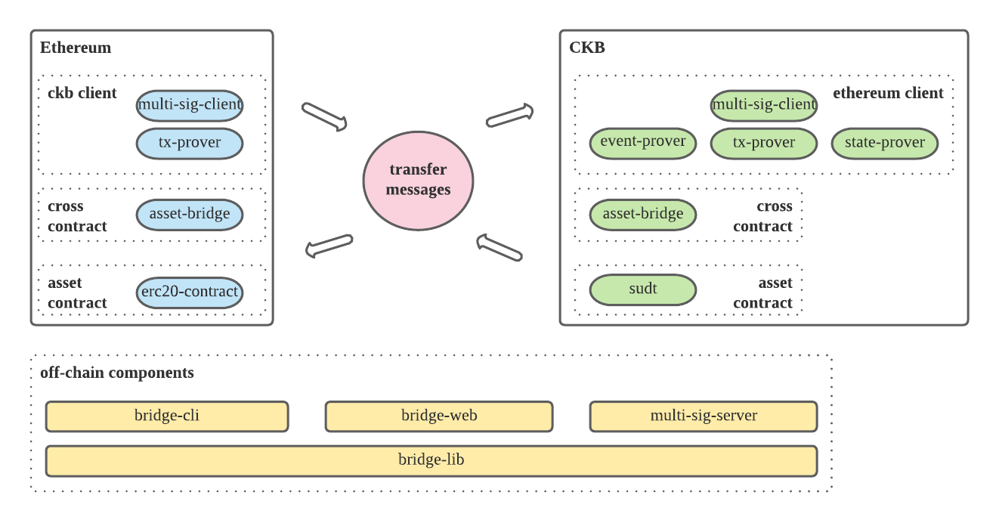

# Header Relayer Guide

> This document is intended for community who is interested in operating a header relayer for Force Bridge. If you are not familiar with Force Bridge yet, you can start from [introduction](./introduction.md) and [step by step guide](./step-by-step-guide.md).



As we can see in the architecture, there are roles to **transfer messages** between Ethereum and CKB.

According to the type of messages they transferred, we can define two roles:
- header relayer
- cross chain transaction relayer

Header relayer is the role who maintains the light client on chain. They watch both Ethereum and CKB chain, compose transaction with latest block information and submit it on the opposite chain.

Cross chain transaction relayer also watch both Ethereum and CKB chain, but they care about cross chain transactions other than block updates. When they see cross chain transactions, they compose transactions along with proof and submit it on the opposite chain.

In the first stage of Force Bridge, the light client will be maintained by multiple signatures of a committee composed of Nervos Foundation and other community members.

## Header Relayer Setup Process

1. We find some partners to operate force bridge together and decide the initial committee multi-signature parameters. E.g. 5 of 7 multi-signature to make it both reliable and fault-tolerant.
2. Every member generate their private keys for both Ethereum and CKB chain, calculate the Ethereum address and public key hash. Then we can use the addresses and public key hashes to set the contracts.
3. There are two roles in the committee. The `Collector` watches block updates, compose the transaction to update the light client and collect signatures from other members. The `Verifier` run a web service, receive the HTTP request from Collector, verify the transaction and reply its signature if it is valid. We should decide the role of every member.
4. The Verifier run a [sign server](https://github.com/nervosnetwork/sign-server) and give the Collector the endpoint, e.g. `http://40.12.34.212:23423/sign_server`.
5. The Collector run **header relayer process** with [force-eth-cli](https://github.com/nervosnetwork/force-bridge-eth/blob/main/offchain-modules/cli/Cargo.toml). It will maintain endpoints of all Verifiers. When the Collector compose a transaction, it will request the signature of other members. When the Collector gets enough signature, it will send the transaction to the chain.
6. As long as the Verifiers start their sign server, and the Collector start the header relayer, they will cooperation to update the light clients on chain automatically.

## Requirements

What a Verifier has to do is run a HTTP web service to verify light client transactions and reply his signature for valid transactions.

- software requirements
    - The sign server is written in Rust. Any platform compatible should be OK.
    - The sign server needs to interact with both Ethereum and CKB chain to verify the transactions. Considering the stability of the service, it's recommended to maintain a full node ourselves, or use the commercial service like [infura](https://infura.io/).
    - The server should be capable of visited with public IP address or domain.
- hardware requirements
    - The header relay process is not resource consuming, 2 Core CPU and 4G Ram should be enough.

You can run the sign server with a simple command. There are no other dependencies. You can start it with process monitor tools like `systemd`, `pm2` to make it more robust.

```
sign-server run --config-path conf/config.toml --listen-url 0.0.0.0:3031 --ckb-key-path conf/ckb_key --eth-key-path conf/eth_key --cell-script 590000001000000030000000310000001313a0eaa571a9168e44ceba1a0d0a328840d9de43aab2388af7c860b57c9a0c01240000005edca2d744b6eaa347de7ff0edcd2e6e88ab8f2836bcbd0df0940026956e5f8107000000
```