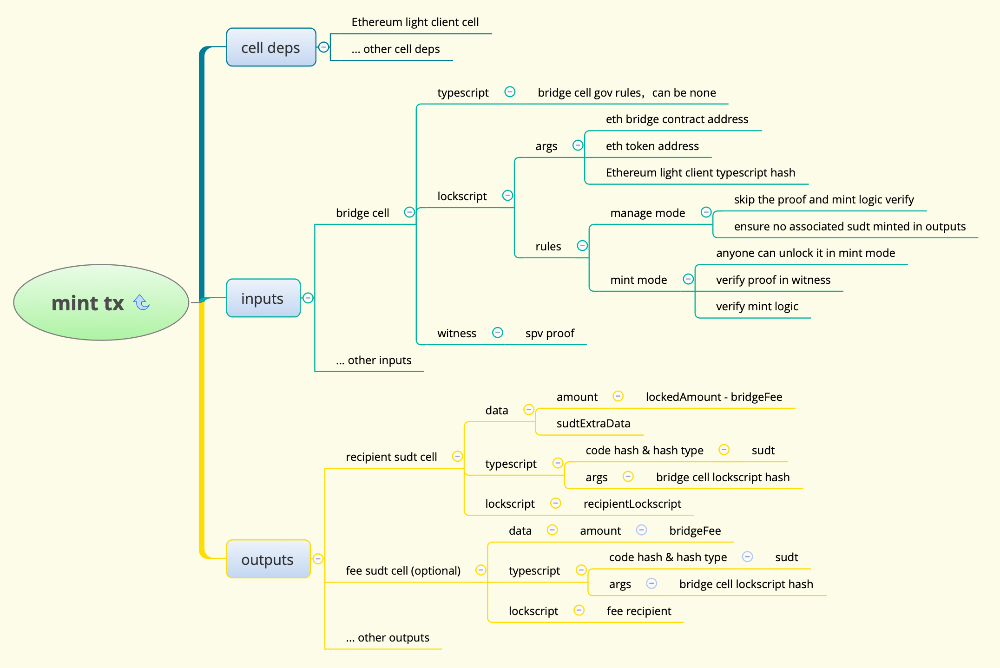
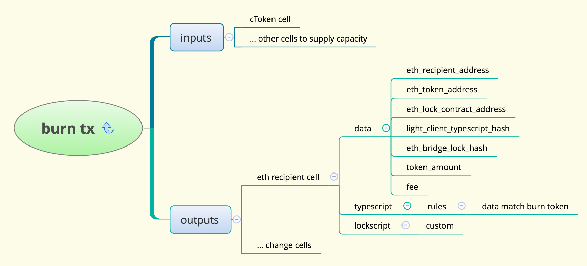

# A Step-by-step Guide of Force Bridge Crosschain Process

- [A Step-by-step Guide of Force Bridge Crosschain Process](#a-step-by-step-guide-of-force-bridge-crosschain-process)
  - [transfer from Ethereum Chain to CKB Chain](#transfer-from-ethereum-chain-to-ckb-chain)
    - [lock ETH on Ethereum](#lock-eth-on-ethereum)
    - [mint ckETH on CKB Chain](#mint-cketh-on-ckb-chain)
      - [Ethereum light client cell](#ethereum-light-client-cell)
      - [bridge cell typescript](#bridge-cell-typescript)
      - [bridge cell lockscript](#bridge-cell-lockscript)
      - [bridge cell witness](#bridge-cell-witness)
      - [outputs](#outputs)
  - [transfer CKB mirror token back to Ethereum](#transfer-ckb-mirror-token-back-to-ethereum)
    - [burn CKB mirror token](#burn-ckb-mirror-token)
    - [unlock on Ethereum](#unlock-on-ethereum)
  - [run the whole process locally](#run-the-whole-process-locally)
  - [bridge cell governance](#bridge-cell-governance)
    - [simple eth bridge typescript](#simple-eth-bridge-typescript)
    - [eth bridge typescript](#eth-bridge-typescript)

This is a step by step guide to understand the crosschain process of force bridge.

This doc is based on tag [audit-v1.2](https://github.com/nervosnetwork/force-bridge-eth/tree/audit-v1.2).

Before reading this document, you can check [introduction](https://github.com/nervosnetwork/force-bridge-eth/blob/audit-v1.2/docs/introduction.md) document to look for the architecture and high level process description.

## transfer from Ethereum Chain to CKB Chain

There are two steps if you want to transfer your Ethereum assets to CKB Chain.

1. Lock you asset(ETH or ERC20) in bridge contract on Ethereum.
2. Wait until the block which contains your Ethereum lock transaction is confirmed in Ethereum light client on CKB Chain. Then compose a CKB Chain transaction, which includes the merkle proof of your Ethereum lock transaction as witness, to mint associated SUDT on CKB Chain.

### lock ETH on Ethereum

Let's take transfer ETH as an example.

The first step is to call `lockETH` in [TokenLocker.sol](https://github.com/nervosnetwork/force-bridge-eth/blob/audit-v1.2/eth-contracts/contracts/TokenLocker-openzeppelin.sol#L72-L77).

This is an example of lock tx on Ethereum: <https://ropsten.etherscan.io/tx/0x1df2a7020f12060e74f369aabfd02ab848b77ca4448194bf4bdc8f74f677704e>

The signature of the function is:

```
function lockETH(
    uint256 bridgeFee,
    bytes memory recipientLockscript,
    bytes memory replayResistOutpoint,
    bytes memory sudtExtraData
) public payable {}
```

This function receives you ETH, and emit an event like below:

```
event Locked(
    address indexed token,
    address indexed sender,
    uint256 lockedAmount,
    uint256 bridgeFee,
    bytes recipientLockscript,
    bytes replayResistOutpoint,
    bytes sudtExtraData
);
```

Let's talk about the parameters here.

- bridgeFee. It is the crosschain fee which will be charged on CKB Chain when minting the mirror token. If you locked 1 ETH and set the bridgeFee as 0.001 ETH here, you will receive 0.999 ckETH on CKB. The fee is adjusted by market. We'll talk about it later.
- recipientLockscript. Lockscript is similar to ETH address, so this parameter indicates who will receive the token on CKB.
- replayResistOutpoint. This is a parameter to resist replay attack on CKB, we'll talk about it later.
- sudtExtraData. [SUDT](https://github.com/nervosnetwork/ckb-miscellaneous-scripts/blob/master/c/simple_udt.c) is a user defined token standard on CKB. It uses the first 16 bytes of cell data as u128 to represent amount. Users can extend it with data after that. So you can specify sudtExtraData when you lock asset. For DApps which use lockscript and sudt extended data, you can interact with them in one step, e.g. you can get an dex order  instead of a normal sudt cell when you crosschain. For normal asset transfer, you can just use an empty bytes.

When the lock ETH transaction is confirmed on Ethereum. The first step is finished.

We can compose the merkle-patricia-proof as long as we get the transaction receipt.

The ideas here is:
- We maintained an Ethereum light client on CKB. We can verify that a block hash in valid.
- We can calculate hash from raw header. So we can verify that a raw header is valid.
- The raw eth header contains receipt root, we can use it to verify that a receipt is valid with merkle proof.
- We can parse logs from the receipt and get the information to verify the mint process on CKB.

### mint ckETH on CKB Chain

The second step is to send a tx on CKB chain to mint ckETH.

This is an example:

<https://explorer.nervos.org/aggron/transaction/0x91a6b075bd1c885c1d4e7a8024db7e10e58ad88d060a1f2d960b47f3b87d5aa5>

There are 2 inputs and 3 outputs in this tx. The main logic here is the first input cell, first output cell and first cell dep.

We can simplify it as below:



If you are not familiar with CKB tx, you can check <https://github.com/nervosnetwork/rfcs/blob/master/rfcs/0022-transaction-structure/0022-transaction-structure.md> for more details.

Here are some additional description.

#### Ethereum light client cell

This cell maintains the Ethereum light client. We refer it in cell deps to verify the proof in witness.

The typescript of the cell is [eth-light-client-typescript](https://github.com/nervosnetwork/force-bridge-eth/blob/audit-v1.2/ckb-contracts/lib/eth-light-client-typescript-lib/src/lib.rs).

The typescript itself ensures there will be at most one live cell on CKB Chain with the same typescript hash. So we can use it in bridge cell lockscript args to prevent someone use fake light client to compose fake proof and mint token.

The lockscript of the cell is [multi-sig script](https://github.com/nervosnetwork/rfcs/blob/master/rfcs/0024-ckb-system-script-list/0024-ckb-system-script-list.md#secp256k1multisig) in CKB system script. So the committee who maintains the light client cell can update this cell data with their signatures.

The data structure is defined in [eth_header_cell.mol](https://github.com/nervosnetwork/force-bridge-eth/blob/audit-v1.2/ckb-contracts/types/schemas/eth_header_cell.mol#L3-L7).

```
struct ETHHeaderCellMerkleData {
    merkle_root: Byte32,
    start_height: Uint64,
    latest_height: Uint64,
}
```

We use a [sparse merkle tree](https://github.com/jjyr/sparse-merkle-tree) root here to reduce the data size.

The tree can be composed with all the header hashes from start_height to latest_height on Ethereum Mainnet. The key is height, and value is header hash.

We can submit a merkle proof of block hash on specific height in mint tx to verify that the header in spv proof is valid on Ethereum Mainnet.

#### bridge cell typescript

It is an extended gov script. We can leave it null here. But the risk here is that someone else can use the bridge cell you created to mint their asset. You will lose the CKB in this cell. The simplest practical script is that you can ensure that only you can use this bridge cell. We can design very flexible rules here depend on the facts who will send the tx, how much fee will be charged, the cost of the the tx and so on. There will be a chapter to explain the details later.

#### bridge cell lockscript

This is the most important script in this tx. It verifies most of the crosschain logics.

The args is a byte array serialized with [molecule](https://github.com/nervosnetwork/rfcs/blob/master/rfcs/0008-serialization/0008-serialization.md). The structure is defined [here](https://github.com/nervosnetwork/force-bridge-eth/blob/audit-v1.2/ckb-contracts/types/schemas/eth_bridge_lock_cell.mol).

```
struct ETHBridgeLockArgs {
    eth_contract_address: ETHAddress,
    eth_token_address: ETHAddress,
    light_client_typescript_hash: Byte32,
}
```

There are 3 fields in args:
- eth_contract_address. It is the bridge contract address on CKB. We will check it in the contract to prevent that someone uses fake contract to compose spv proof.
- eth_token_address. It is the asset address on Ethereum. For ETH, it is 0x0000000000000000000000000000000000000000, for ERC20, it is the ERC20 contract address.
- light_client_typescript_hash. This is the unique identity of Ethereum light client cell.

As long as we deployed all the contracts and set up the Ethereum light client, eth_contract_address and light_client_typescript_hash will be fixed. But the eth_token_address differs when you transfer different asset. The bridge cell lockscript hash will be used as the [sudt owner hash](https://github.com/nervosnetwork/ckb-miscellaneous-scripts/blob/master/c/simple_udt.c). The owner hash is the identity of an sudt on CKB Chain(just like ERC20 address on Ethereum). For different eth_token_address here, we'll have the associated sudt in the outputs. This is how we support ETH and all ERC20s crosschain without deploy new contracts.

This script will verify that:
- The block which concludes the receipt exists on ETH Mainnet and is confirmed with at least 15 blocks.
- The receipt in witness is valid according to the receipt proof.
- The cross-chain logic is valid according to the locked event parsed from receipt data.

Let's recall the locked event again.

```
event Locked(
    address indexed token,
    address indexed sender,
    uint256 lockedAmount,
    uint256 bridgeFee,
    bytes recipientLockscript,
    bytes replayResistOutpoint,
    bytes sudtExtraData
);
```

The cross-chain logic verification will concludes:
- The `replayResistOutpoint` exists in the tx inputs. This is the way to resist replay attack. [Outpoint](https://github.com/nervosnetwork/rfcs/blob/master/rfcs/0019-data-structures/0019-data-structures.md#outpoint) is like a pointer for a cell. In CKB cell model, a cell can only be consumed once. With this limit on CKB Chain, we can prevent that users use one lock event to mint multiple times. Normally we will use the bridge cell as the replayResistOutpoint, but the script will only verify that the replayResistOutpoint exists in the tx inputs, so we can use any cell you will use in the mint tx as the replayResistOutpoint when you send the lock tx on Ethereum, e.g. the cell you will use to pay for the tx fee.
- The recipientLockscript receives amount of (lockedAmount - bridgeFee) SUDT (which is mirror token for ETH address `token` here). The sudtExtraData will be put in the sudt data part, just after the amount data.

#### bridge cell witness

The witness structure is defined at [witness.mol](https://github.com/nervosnetwork/force-bridge-eth/blob/audit-v1.2/ckb-contracts/types/schemas/witness.mol).

```
table MintTokenWitness {
    mode: byte,
    spv_proof: Bytes,
    cell_dep_index_list: Bytes,
    merkle_proof: Bytes,
}

table ETHSPVProof {
    log_index: Uint64,
    receipt_index: Uint64,
    receipt_data: Bytes,
    header_data: Bytes,
    proof: BytesVec,
}
```

MintTokenWitness fields description.
- mode
  - 0: mint mode, user can mint token with the proof provided
  - others: manage mode, user can charge capacity or destroy this cell, and the tx can not contains associated sudt in outputs.
- spv_proof
  - It is serialized bytes with molecule itself. The structure is defined in ETHSPVProof.
- cell_dep_index_list
  - It is a u8 array to specify the cell deps indies we used. For now it contains only 1 element, which is the index of
    light client cell in cell deps.
- merkle_proof
  - It is the sparse merkle tree inclusion proof of the eth header. We only have the sparse merkle tree root in light
    client cell. This proof proves that the header in ETHSPVProof does exist in the light client. The bytes here is
    the [CompiledMerkleProof](https://github.com/jjyr/sparse-merkle-tree/blob/master/src/merkle_proof.rs#L297).

ETHSPVProof fields description.
- header_data
  - The rlp encoded bytes of raw Ethereum header.
- receipt_data
  - The rlp encoded bytes of receipt data.
- receipt_index
  - Receipt index in the block.
- log_index
  - Log index of the lock event log we want.
- proof
  - The receipt proof that proves receipt data is valid.

references:
- https://github.com/blockchainsllc/in3-legacy/wiki/Ethereum-Verification-and-MerkleProof#receipt-proof
- https://eth.wiki/en/fundamentals/patricia-tree

#### outputs

The outputs here is the sudt we mint. The amount is specified in the event log in witness.

When the mint tx is committed on CKB Chain, we finish transferring asset from Ethereum to CKB Chain. And get the mirror token (which is ckETH here) on CKB chain.


## transfer CKB mirror token back to Ethereum

### burn CKB mirror token

The first step to transfer CKB mirror token back to Ethereum is to burn it on CKB Chain.

This is an example <https://explorer.nervos.org/aggron/transaction/0xbacd5b70928ff0180d70bccb8313ca6bc7c2415d3cc75055154baf9cd00b0d09>.

We can simplify it as below.




The idea here is:
- When we burn the mirror token, we use a script (eth recipient cell typescript) to ensure that we get a verified data in the output.
- We submit the raw tx along with its merkle proof on Ethereum to unlock the associated asset.

The data structure is located at [eth_recipient_cell.mol](https://github.com/nervosnetwork/force-bridge-eth/blob/audit-v1.2/ckb-contracts/types/schemas/eth_recipient_cell.mol). And the typescript code is located at [eth-recipient-typescript](https://github.com/nervosnetwork/force-bridge-eth/blob/audit-v1.2/ckb-contracts/lib/eth-recipient-typescript-lib/src/lib.rs).

Let's recall the bridge lockscript and sudt typescript structure:

```
bridge lockscript
- code hash
- hash type
- args
    - eth_contract_address
    - eth_token_address
    - light_client_typescript_hash

sudt typescript
- code hash
- hash type
- args
    - bridge lockscript hash
```

We can compose the sudt typescript from bottom with the data fields and then compare it with all the inputs and outputs, calculate the burn amount of this tx.

We can put any Ethereum address in `eth_recipient_address` field to indicate who will receive the asset on Ethereum.

The amount of asset specified in `fee` field will be send to the sender of the unlock tx on Ethereum. On CKB Chain side, we will verify that it is less than token_amount. This is used to incent others to relay the tx proof for you. You can also set to 0 and send the unlock tx on Ethereum yourself.

### unlock on Ethereum

When the burn tx is confirmed on CKB Chain, we can submit the proof on Ethereum to unlock the associated asset.

The signature of the function is:

```
function unlockToken(bytes memory proof)
```

The parameter of this function is a single byte array serialized with [molecule](https://github.com/nervosnetwork/rfcs/blob/master/rfcs/0008-serialization/0008-serialization.md).

The schema of the data structure is defined [here](https://github.com/nervosnetwork/force-bridge-eth/blob/audit-v1.2/offchain-modules/lib/src/util/schemas/ckb_tx_proof.mol)
and showed below.

```
table CKBHistoryTxProof {
    block_number:               Uint64,
    tx_merkle_index:            Uint16,
    witnesses_root:             Byte32,
    lemmas:                     Byte32Vec,
    raw_transaction:            Bytes,
}

table CKBHistoryTxRootProof {
    init_block_number:      Uint64,
    latest_block_number:    Uint64,
    indices:                Uint64Vec,
    proof_leaves:           Byte32Vec,
    lemmas:                 Byte32Vec,
}

vector CKBHistoryTxProofVec <CKBHistoryTxProof>;

table CKBUnlockTokenParam {
    history_tx_root_proof:  CKBHistoryTxRootProof,
    tx_proofs: CKBHistoryTxProofVec,
}
```

- `CKBUnlockTokenParam`: The `proof` parameter data structure in `unlockToken` function.
- `history_tx_root_proof`. The `CKBChain.sol` contract maintains the merkle root of the CKB main chain.
  `history_tx_root_proof` is the proof to verify that specified blocks exist on the main chain. The merkle tree algorithm we
  used is [Complete Binary Merkle Tree](https://github.com/nervosnetwork/merkle-tree) (CBMT) instead of classic merkle tree used
  in Bitcoin. The nodes in the tree is [`transactions_root`](https://github.com/nervosnetwork/rfcs/blob/master/rfcs/0019-data-structures/0019-data-structures.md#header)
  from `init_block_number` to `latest_block_number`. CBMT can generate proof for multiple nodes at the same time.
- `tx_proofs` is the a vector of `CKBHistoryTxProof`. Each one is a merkle proof to verify that a `raw_transaction` is valid
  given a valid `transactions_root`.

With the data structure above, we can construct a single proof for multiple burn tx on CKB.

The Ethereum contract will parse the proof, verify that it is a valid tx on CKB Chain, compare the fields in ETHRecipientCellData matches the params stored in the contract, and then unlock the asset to specified eth_recipient_address.

## run the whole process locally

1. Install rust.
2. Install docker.
3. Enter the project directory. Run `make local-ci`.

It will run all the services in docker, including ETH dev chain, CKB dev chain, relayers. Then use the cli tool to do the crosschain actions.

It may take around half an hour. You can also check it in our [github workflows](https://github.com/nervosnetwork/force-bridge-eth/actions?query=workflow%3Aintegration-ci).

Check the Makefile if you want to know more details.

## bridge cell governance

As we mentioned previously, the bridge typescript can be designed with flexibility. We provide 2 examples in the project.

### simple eth bridge typescript

It uses a similar mechanism as sudt. We put a script hash in script args as an ownership symbol. As long as the script hash appears in the input lockscripts, you have the ownership to unlock it.

For example, you can use your [SECP256K1/blake160](https://github.com/nervosnetwork/rfcs/blob/master/rfcs/0024-ckb-system-script-list/0024-ckb-system-script-list.md#secp256k1blake160) lockscript hash as the args. Then anyone can not unlock the bridge cell without your signature.

### eth bridge typescript

This is a more complicated governance mechanism. The script args and data structure is located at [eth_bridge_type_cell.mol](https://github.com/nervosnetwork/force-bridge-eth/blob/audit-v1.2/ckb-contracts/types/schemas/eth_bridge_type_cell.mol).

```
struct ETHBridgeTypeArgs {
    bridge_lock_hash: Byte32,
    recipient_lock_hash: Byte32,
}

table ETHBridgeTypeData {
    owner_lock_script: Bytes,
    fee: Uint128,
}
```

The rules of the script are:
- Any 3rd party, e.g. tx relayer or dapp operator, can crate the bridge cell for you.
- Anyone can unlock the cell as long as it is used in mint mode for specific token, the recipient_lock_hash matches the args, and the owners receives mirror token more than fee field.
    - The 3rd party pays CKB capacity of the bridge cell for recipient, charges the mirror token on CKB. Users can choose use the bridge cell or not. So the fee will be determined by the market. It is a little bit similar to gas price.
- If user does not use it to mint for a long time, the owner can destroy the cell and get the capacity(CKB) it takes back.